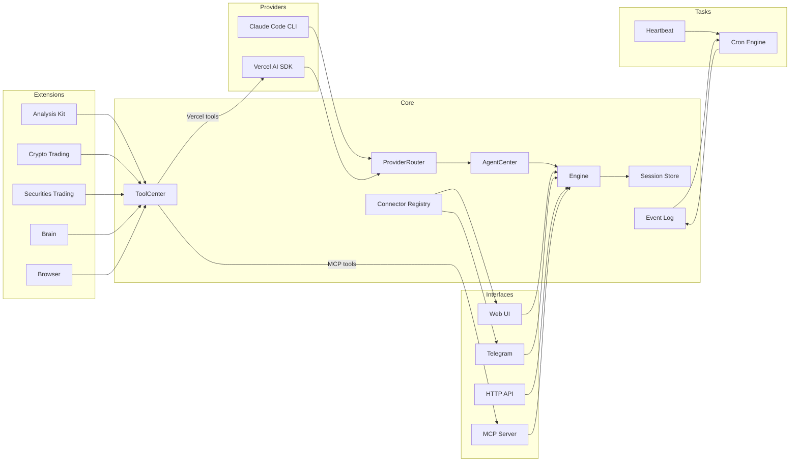

<p align="center">
  
</p>

<p align="center">
  <a href="https://deepwiki.com/TraderAlice/OpenAlice">📖 Documentation</a> · <a href="https://traderalice.com/live">🔴 Live Demo</a> · <a href="https://github.com/TraderAlice/OpenAlice/blob/master/LICENSE">MIT License</a>
</p>

# Open Alice

Your one-person Wall Street. Alice is an AI trading agent that gives you your own research desk, quant team, trading floor, and risk management — all running on your laptop 24/7.

- **File-driven** — Markdown defines persona and tasks, JSON defines config, JSONL stores conversations. Both humans and AI control Alice by reading and modifying files. The same read/write primitives that power vibe coding transfer directly to vibe trading. No database, no containers, just files.
- **Reasoning-driven** — every trading decision is based on continuous reasoning and signal mixing. Visit [traderalice.com/live](https://traderalice.com/live) to see how Alice reasons in real time.
- **OS-native** — Alice can interact with your operating system. Search the web through your browser, send messages via Telegram, and connect to local devices.

## Features

- **Dual AI provider** — switch between Claude Code CLI and Vercel AI SDK at runtime, no restart needed
- **Crypto trading** — CCXT-based execution (Bybit, OKX, Binance, etc.) with a git-like wallet (stage, commit, push)
- **Pre-trade risk guard** — hard risk checks before order placement (kill switch, leverage cap, max order notional, max position size, max daily loss)
- **Securities trading** — Alpaca integration for US equities with the same wallet workflow
- **Market analysis** — technical indicators, news search, and price simulation via sandboxed tools
- **Strategy tools** — built-in `trend`, `meanReversion`, `breakout`, and `ensemble` strategies with cost-aware backtesting and strategy comparison
- **ML Ensemble V1** — optional Python-based prediction ensemble (`XGBoost + LightGBM + CatBoost + RandomForest + Ridge`) exposed as an AI tool
- **Historical data downloader** — bulk OHLCV export from OKX (config symbols or full USDT universe) with resume support
- **Cross-exchange backfill** — Binance public historical downloader to recover additional/legacy symbols for anti-survivorship datasets
- **Cognitive state** — persistent "brain" with frontal lobe memory, emotion tracking, and commit history
- **Event log** — persistent append-only JSONL event log with real-time subscriptions and crash recovery
- **Cron scheduling** — event-driven cron system with AI-powered job execution and automatic delivery to the last-interacted channel
- **Evolution mode** — two-tier permission system. Normal mode sandboxes the AI to `data/brain/`; evolution mode gives full project access including Bash, enabling the agent to modify its own source code
- **Web UI** — built-in local chat interface on port 3002, no Telegram account needed

## Recent Additions

- Added `strategyGetSignal`, `strategyBacktest`, and `strategyCompare` tools with realistic cost modeling (fees, slippage, latency, funding rate).
- Added `ensemble` strategy mode that combines `trend`, `meanReversion`, and `breakout` with weighted voting.
- Added pre-trade risk gate on crypto order execution path with configurable hard limits in `data/config/risk.json`.
- Added `mlEnsemblePredict` tool backed by Python ensemble models and test-set accuracy reporting.
- Added `pnpm ml:eval` for reproducible OKX-based ML evaluation from the CLI.

## Architecture



**Providers** — interchangeable AI backends. Claude Code spawns `claude -p` as a subprocess; Vercel AI SDK runs a `ToolLoopAgent` in-process. `ProviderRouter` reads `ai-provider.json` on each call to select the active backend at runtime.

**Core** — `Engine` is a thin facade that delegates to `AgentCenter`, which routes all calls (both stateless and session-aware) through `ProviderRouter`. `ToolCenter` is a centralized tool registry — extensions register tools there, and it exports them in Vercel AI SDK and MCP formats. `EventLog` provides persistent append-only event storage (JSONL) with real-time subscriptions and crash recovery. `ConnectorRegistry` tracks which channel the user last spoke through.

**Extensions** — domain-specific tool sets registered in `ToolCenter`. Each extension owns its tools, state, and persistence.

**Tasks** — scheduled background work. `CronEngine` manages jobs and fires `cron.fire` events into the EventLog on schedule; a listener picks them up, runs them through the AI engine, and delivers replies via the ConnectorRegistry. `Heartbeat` is a periodic health-check that uses a structured response protocol (HEARTBEAT_OK / CHAT_NO / CHAT_YES).

**Interfaces** — external surfaces. Web UI for local chat, Telegram bot for mobile, HTTP for webhooks, MCP server for tool exposure. External agents can also [converse with Alice via a separate MCP endpoint](docs/mcp-ask-connector.md).

## Quick Start

### Prerequisites

- Node.js 22+
- pnpm 10+

### Setup

```bash
git clone https://github.com/TraderAlice/OpenAlice.git
cd OpenAlice
pnpm install
cp .env.example .env    # then fill in your keys
```

### AI Provider

OpenAlice ships with two provider modes:

- **Vercel AI SDK** (default) — runs the agent in-process. Supports any provider compatible with the [Vercel AI SDK](https://sdk.vercel.ai/docs) (Anthropic, OpenAI, Google, etc.). Swap the provider implementation in `src/providers/vercel-ai-sdk/` to use your preferred model. Requires an API key for your chosen provider (e.g. `ANTHROPIC_API_KEY` for Anthropic).
- **Claude Code** (file-driven mode) — spawns `claude -p` as a subprocess, giving the agent full Claude Code capabilities. Requires [Claude Code](https://docs.anthropic.com/en/docs/claude-code) installed and authenticated on the host machine. No separate API key needed — uses your Claude Code login. To switch models, see [how to change Claude Code's model](https://docs.anthropic.com/en/docs/claude-code/settings#model-configuration).

### Crypto Trading

Powered by [CCXT](https://docs.ccxt.com/). Defaults to Bybit demo trading. Configure the exchange and API keys in `data/config/crypto.json` and `.env`. Any CCXT-supported exchange can be used by modifying the provider implementation.

### Trading Safety Defaults

OpenAlice now enforces secure-by-default behavior on the crypto execution path:

- `TRADE_TOKEN` or `AUTH_TOKEN` is required before CCXT trading engine initialization.
- Live mode is blocked by default when both `sandbox=false` and `demoTrading=false`.
- Explicit live override requires `ALLOW_LIVE_TRADING=true`.
- For isolated local debugging only, token enforcement can be disabled with `DISABLE_TRADE_AUTH_TOKEN_ENFORCE=true`.

Recommended rollout order:

1. Run strategy and execution validation in sandbox/demo first.
2. Run paper/shadow checks with the same decision pipeline.
3. Enable real live mode only with explicit override and risk controls.

### Securities Trading

Powered by [Alpaca](https://alpaca.markets/). Supports paper and live trading — toggle via `data/config/securities.json`. Sign up at Alpaca and add your keys to `.env`. IBKR support is planned.

### Environment Variables

| Variable | Description |
|----------|-------------|
| `ANTHROPIC_API_KEY` | API key for Vercel AI SDK provider (not needed if using Claude Code CLI) |
| `EXCHANGE_API_KEY` | Crypto exchange API key (optional) |
| `EXCHANGE_API_SECRET` | Crypto exchange API secret (optional) |
| `EXCHANGE_PASSWORD` | Exchange passphrase for providers that require it (for example OKX) |
| `TRADE_TOKEN` | Auth token for trade interface guard (recommended; required unless enforcement is disabled) |
| `AUTH_TOKEN` | Alternate auth token accepted by trade interface guard |
| `ALLOW_LIVE_TRADING` | Set to `true` to explicitly allow live trading when sandbox/demo is off (default: blocked) |
| `DISABLE_TRADE_AUTH_TOKEN_ENFORCE` | Set to `true` only for isolated local debugging to bypass token check |
| `REALTIME_DATA_API_URL` | Override market feed endpoint (default is DotAPI sandbox feed) |
| `TELEGRAM_BOT_TOKEN` | Telegram bot token (optional) |
| `TELEGRAM_CHAT_ID` | Comma-separated chat IDs to allow (optional) |
| `ALPACA_API_KEY` | Alpaca API key for securities (optional) |
| `ALPACA_SECRET_KEY` | Alpaca secret key for securities (optional) |
| `ML_ENSEMBLE_PYTHON` | Optional absolute path to Python executable for ML Ensemble V1 |

### Realtime Data Source Note

- Default market feed endpoint is DotAPI sandbox (`https://dotapi.wond.dev/sandbox/realtime-data`).
- For true real-time strategy execution, set `REALTIME_DATA_API_URL` to a direct exchange feed path (for example OKX WS/REST adapter) and keep decision + execution on a unified clock.
- If you run live orders against delayed/sandbox signal sources, you should assume structural execution bias.

### Run

```bash
pnpm dev        # start backend (port 3002) with watch mode
pnpm dev:ui     # start frontend dev server (port 5173) with hot reload
pnpm build      # production build (backend + UI)
pnpm data:download:okx -- --universe config --timeframe 1h --start 2023-01-01
pnpm data:download:binance -- --source okx-usdt --market both --timeframe 1d --startMonth 2020-01
pnpm data:report:universe -- --quote USDT
pnpm ml:eval    # run ML Ensemble V1 evaluation on recent OKX candles
pnpm test       # run tests
```

### ML Ensemble V1 (Optional)

`mlEnsemblePredict` uses a local Python runtime. This is optional, but required if you want ML predictions and accuracy reports.

1. Create a virtual environment and install Python dependencies:

```bash
python3 -m venv .venv
.venv/bin/pip install -r scripts/requirements-ml-ensemble.txt
```

2. On macOS, install OpenMP runtime for XGBoost/LightGBM:

```bash
brew install libomp
```

3. Run a quick evaluation (example):

```bash
pnpm ml:eval -- --symbol BTC/USDT:USDT --hours 1600 --horizonBars 1 --trainRatio 0.8
```

The output includes direction accuracy vs baseline, AUC, MAE/RMSE, and latest prediction (`buy` / `sell` / `hold`) with confidence and expected return.

### OKX Historical Download

Use the built-in downloader to export OHLCV CSV files under `data/market/okx/`.

```bash
# 1) Download configured symbols from data/config/crypto.json
pnpm data:download:okx -- --universe config --timeframe 1h --start 2023-01-01

# 2) Download all active USDT swap markets (cap to first 50 symbols for smoke test)
pnpm data:download:okx -- --universe all-swap-usdt --maxSymbols 50 --timeframe 1h --start 2024-01-01

# 3) Resume append on rerun (default append=true)
pnpm data:download:okx -- --universe config --timeframe 1h --start 2023-01-01 --append true

# 4) Download full spot+swap universe (including inactive symbols currently returned by OKX)
pnpm data:download:okx -- --universe all --includeInactive true --timeframe 1d --start 2018-01-01
```

Useful flags:

- `--symbols BTC/USDT:USDT,ETH/USDT:USDT` direct CCXT symbol list
- `--internalSymbols BTC/USD,ETH/USD` map internal symbols via loaded OKX markets
- `--universe config|all|all-swap|all-spot|all-swap-usdt|all-spot-usdt|all-usdt`
- `--includeInactive true|false` include/exclude markets with `active=false`
- `--start` / `--end` date range
- `--limit` / `--maxRetries` / `--sleepMs` request pacing & retry control

Each run writes a `summary.json` in the output directory with per-symbol stats and any failures.

### Binance Public Backfill (Anti-survivorship)

Use Binance's public monthly kline archives to supplement symbols that may no longer be reliably retrievable from current exchange APIs.

```bash
# 1) Backfill symbols aligned with OKX USDT universe (spot + UM futures)
pnpm data:download:binance -- --source okx-usdt --market both --timeframe 1d --startMonth 2020-01

# 2) Aggressive mode: all Binance USDT symbols (includes many legacy symbols)
pnpm data:download:binance -- --source binance-all-usdt --market both --timeframe 1d --startMonth 2018-01

# 3) Custom symbol list
pnpm data:download:binance -- --source symbols --symbols BTCUSDT,ETHUSDT --market both --timeframe 1h --startMonth 2024-01 --endMonth 2024-12
```

Useful flags:

- `--maxSymbols` / `--maxMonths` for smoke tests
- `--concurrency` / `--maxRetries` / `--sleepMs` for throughput and stability
- `--extract true` to unzip CSV alongside ZIP files
- `--skipExisting true` for resumable reruns

Outputs are written under `data/market/binance-public/` with a run summary at `summary.binance-download.json`.

### Universe Coverage Report

Generate a quick coverage report across OKX vs Binance public archives (useful for estimating anti-survivorship gap size):

```bash
pnpm data:report:universe -- --quote USDT --topN 200
```

Default output: `data/market/universe/report.json`

### Full Train Pipeline (Wait -> Clean -> Retrain)

After starting long-running downloads, you can launch a single pipeline that waits for completion, cleans all data into a new folder, then retrains across symbols:

```bash
pnpm train:full-pipeline -- \
  --wait-downloads true \
  --output-root data/training-data/full-v1 \
  --min-bars 220 \
  --horizon-bars 1 \
  --train-ratio 0.8 \
  --selection-objective accuracyLift \
  --selection-mode auto \
  --labeling-mode next_return_sign \
  --nas-enabled false
```

Notes:

- `pnpm train:full-pipeline` uses `./.venv/bin/python` (with `PYTHONWARNINGS=ignore`) to avoid system-Python dependency mismatches.
- Make sure ML dependencies are installed first (`.venv/bin/pip install -r scripts/requirements-ml-ensemble.txt`).
- To skip waiting and retrain immediately after downloads are already done, set `--wait-downloads false`.
- `--selection-objective` controls model selection target (`accuracyLift`, `directionAccuracy`, `auc`, `maePct`, `rmsePct`, `costAwareUtility`).
- `--selection-mode` controls optimization direction (`auto|max|min`), where `auto` minimizes `maePct/rmsePct` and maximizes others.
- `--labeling-mode` supports `next_return_sign` and `triple_barrier`.
- Triple-barrier knobs: `--barrier-tp-atr`, `--barrier-sl-atr`, `--barrier-max-horizon-bars`.
- Cost-aware knobs: `--cost-fee-rate`, `--cost-slippage-bps`, `--cost-latency-bars`.
- Robust objective knob: `--robust-per-bar-clip` (clamps per-bar return for robust utility).
- NAS-like search knobs: `--nas-enabled`, `--nas-trials`, `--nas-metric`, `--nas-mode`.

Artifacts:

- `data/training-data/full-v1/clean/symbols_1d/*.csv` cleaned per-symbol candles
- `data/training-data/full-v1/clean/summary.json` cleaned dataset summary
- `data/training-data/full-v1/retrain/results.json` per-symbol retrain outputs
- `data/training-data/full-v1/retrain/summary.json` aggregate metrics
- `data/training-data/full-v1/retrain/leaderboard.csv` sortable leaderboard

### Full Completion Validation (ML + Multi-Strategy + Readiness Score)

Run a full completion check that:

1. Selects top symbols from retrain results by objective metric.
2. Runs strategy validation for `trend/meanReversion/breakout/ensemble`.
3. Aggregates release-gate pass rates and outputs a completion score/readiness.

```bash
pnpm validation:completion -- \
  --trainingRoot data/training-data/full-v1 \
  --objectiveMetric accuracyLift \
  --objectiveMode auto \
  --topSymbols 8 \
  --minRows 220 \
  --strategies trend,meanReversion,breakout,ensemble \
  --lookbackBars 3000 \
  --minSignificancePassRatio 0.6 \
  --maxMeanPbo 0.2 \
  --minMeanDsrProbability 0.5 \
  --enforceSignificanceHardGate true \
  --runUnitTests false
```

Notes:

- Defaults are tuned for `1d` candles (`trainBars=365`, `testBars=90`, `stepBars=90`).
- The completion script auto-shrinks WFO windows for shorter symbol histories.
- For intraday data (e.g. `1h`), pass larger bars explicitly.
- Completion scoring now includes statistical significance signals (`PBO`, `DSR probability`, significance pass ratio).
- With `--enforceSignificanceHardGate true`, failing significance thresholds caps the final score and forces `readiness=not_ready`.
- `--skipInsufficientSymbols true` filters top symbols that cannot satisfy adaptive WFO window minimums.

Output:

- `logs/research/openalice_completion_*.json` full completion report
- `logs/research/completion_runs/*/*.json` per-symbol/per-strategy validation reports

### V3 Experiment Record (2026-02-22)

This repo now includes a reproducible V3 iteration with:

- NAS-like hyperparameter search in `scripts/ml_ensemble_v1.py`
- cost-aware objective (`costAwareUtility`)
- triple-barrier labeling (`labelingMode=triple_barrier`)
- completion hard gates on significance (`PBO` / `DSR` / pass ratio)

Commands used:

```bash
# Full V3 retrain
pnpm train:full-pipeline -- \
  --wait-downloads false \
  --output-root data/training-data/full-v3 \
  --min-bars 220 \
  --horizon-bars 1 \
  --train-ratio 0.8 \
  --selection-objective costAwareUtility \
  --selection-mode max \
  --labeling-mode triple_barrier \
  --barrier-tp-atr 1.5 \
  --barrier-sl-atr 1.0 \
  --barrier-max-horizon-bars 6 \
  --nas-enabled true \
  --nas-trials 2 \
  --nas-metric costAwareUtility \
  --nas-mode max \
  --cost-fee-rate 0.0006 \
  --cost-slippage-bps 8 \
  --cost-latency-bars 1

# Full V3 completion
pnpm validation:completion -- \
  --trainingRoot data/training-data/full-v3 \
  --objectiveMetric costAwareUtility \
  --objectiveMode max \
  --topSymbols 8 \
  --lookbackBars 3000 \
  --runUnitTests true
```

Artifacts:

- `data/training-data/full-v3/retrain/summary.json`
- `data/training-data/full-v3/retrain/results.json`
- `data/training-data/full-v3/retrain/leaderboard.csv`
- `logs/research/openalice_completion_2026-02-22T20-41-53.263Z.json`

Comparison (full-v2 vs full-v3):

| Metric | full-v2 | full-v3 |
|---|---:|---:|
| trainedSymbols | 756 | 756 |
| errorSymbols | 0 | 0 |
| meanDirectionAccuracy | 0.5353 | 0.5424 |
| meanBaselineDirectionAccuracy | 0.5792 | 0.6397 |
| meanAccuracyLift | -0.0439 | -0.0973 |
| positiveLiftRatio | 0.2077 | 0.1032 |
| meanCostAwareUtility | n/a | 0.0064 |
| completion.score | 22.67 | 19.40 |
| completion.readiness | not_ready | not_ready |
| completion.paperPassRatio | 0.00 | 0.00 |
| completion.livePassRatio | 0.00 | 0.00 |
| completion.meanPbo | n/a | 0.7701 |
| completion.meanDsrProbability | n/a | 0.3614 |

Interpretation:

- V3 infrastructure is fully wired and reproducible, but this configuration is still **not deployment-ready**.
- `triple_barrier + costAwareUtility` under current settings increased class imbalance and reduced lift stability.
- Significance hard gates correctly blocked promotion (`hardGateApplied=true`), which is expected given current `PBO/DSR`.
- Next iteration should focus on:
  1. objective clipping/robustification (outlier-resistant net-return utility),
  2. regime routing (trend vs mean-reversion per symbol),
  3. richer candidate generation in WFO strategy candidates before live gate checks.

### V4 Experiment Record (2026-02-23)

V4 objective update:

- Added robust objective (`robustCostAwareUtility`) in `scripts/ml_ensemble_v1.py`.
- Robust utility uses clipped per-bar net returns (`--robust-per-bar-clip`) + median/MAD stabilization + turnover penalty.
- Added robust metrics to outputs:
  - `robustCostAwareUtility`
  - `robustSharpeAfterCost`
  - `robustSortinoAfterCost`
  - `robustAnnualizedReturnPctAfterCost`
- Completion adaptive WFO minimums were tightened to reduce strategy-window underflow errors.

Commands used:

```bash
# Full V4 retrain
pnpm train:full-pipeline -- \
  --wait-downloads false \
  --output-root data/training-data/full-v4 \
  --min-bars 220 \
  --horizon-bars 1 \
  --train-ratio 0.8 \
  --selection-objective robustCostAwareUtility \
  --selection-mode max \
  --labeling-mode triple_barrier \
  --barrier-tp-atr 1.5 \
  --barrier-sl-atr 1.0 \
  --barrier-max-horizon-bars 6 \
  --nas-enabled true \
  --nas-trials 2 \
  --nas-metric robustCostAwareUtility \
  --nas-mode max \
  --cost-fee-rate 0.0006 \
  --cost-slippage-bps 8 \
  --cost-latency-bars 1 \
  --robust-per-bar-clip 0.25

# Full V4 completion
pnpm validation:completion -- \
  --trainingRoot data/training-data/full-v4 \
  --objectiveMetric robustCostAwareUtility \
  --objectiveMode max \
  --topSymbols 8 \
  --lookbackBars 3000 \
  --runUnitTests true
```

Artifacts:

- `data/training-data/full-v4/retrain/summary.json`
- `data/training-data/full-v4/retrain/results.json`
- `data/training-data/full-v4/retrain/leaderboard.csv`
- `logs/research/openalice_completion_2026-02-23T05-49-45.443Z.json`

Comparison (full-v3 vs full-v4):

| Metric | full-v3 | full-v4 |
|---|---:|---:|
| objectiveMetric | costAwareUtility | robustCostAwareUtility |
| meanObjectiveScore | 0.1240 | 0.2612 |
| meanDirectionAccuracy | 0.5424 | 0.5419 |
| meanAccuracyLift | -0.0973 | -0.0978 |
| positiveLiftRatio | 0.1032 | 0.1005 |
| meanRobustCostAwareUtility | n/a | 0.0159 |
| meanRobustAnnualizedReturnPctAfterCost | n/a | 65.0447 |
| completion.score | 19.40 | 18.26 |
| completion.readiness | not_ready | not_ready |
| completion.paperPassRatio | 0.00 | 0.00 |
| completion.livePassRatio | 0.00 | 0.00 |
| completion.significancePassRatio | 0.0000 | 0.0313 |
| completion.meanPbo | 0.7701 | 0.7670 |
| completion.meanDsrProbability | 0.3614 | 0.3980 |
| completion.hardGateApplied | true | true |
| completion.erroredRuns | 0 | 0 |

Interpretation:

- V4 improved objective stability and significance metrics slightly (`PBO` down, `DSR probability` up), but overall trading readiness remains blocked.
- Core issue remains: no meaningful lift and no paper/live gate pass.
- This indicates model objective refinements alone are insufficient; next gains likely require regime routing + richer strategy candidate search + stronger symbol filtering.

### Web UI

The backend (port 3002) serves both the API and the built frontend from `dist/ui/`. During development, run `pnpm dev:ui` to start Vite's dev server on port 5173, which proxies API requests to port 3002 and provides hot module replacement.

| Port | What | When |
|------|------|------|
| 5173 | Vite dev server (hot reload) | `pnpm dev:ui` |
| 3002 | Backend API + built UI | `pnpm dev` / `pnpm build && node dist/main.js` |

> **Note:** Port 3002 only serves the UI after `pnpm build` (or `pnpm build:ui`). If you haven't built yet, use port 5173 for frontend development.

## Configuration

All config lives in `data/config/` as JSON files with Zod validation. Missing files fall back to sensible defaults.

| File | Purpose |
|------|---------|
| `engine.json` | Trading pairs, tick interval, HTTP/MCP ports, timeframe |
| `model.json` | AI model provider and model name |
| `agent.json` | Max agent steps, evolution mode toggle, Claude Code tool permissions |
| `crypto.json` | Allowed symbols, exchange provider (CCXT), demo trading flag |
| `securities.json` | Allowed symbols, broker provider (Alpaca), paper trading flag |
| `compaction.json` | Context window limits, auto-compaction thresholds |
| `risk.json` | Pre-trade hard risk limits (kill switch, leverage/order/position/daily loss caps) |
| `news.json` | Multi-source institutional news aggregation (RSS feeds, lookback, dedupe, source priority) |
| `heartbeat.json` | Heartbeat enable/disable, interval, active hours |
| `ai-provider.json` | Active AI provider (`vercel-ai-sdk` or `claude-code`), switchable at runtime |

Persona and heartbeat prompts use a **default + user override** pattern:

| Default (git-tracked) | User override (gitignored) |
|------------------------|---------------------------|
| `data/default/persona.default.md` | `data/brain/persona.md` |
| `data/default/heartbeat.default.md` | `data/brain/heartbeat.md` |

On first run, defaults are auto-copied to the user override path. Edit the user files to customize without touching version control.

## Project Structure

```
src/
  main.ts                    # Composition root — wires everything together
  core/
    engine.ts                # Thin facade, delegates to AgentCenter
    agent-center.ts          # Centralized AI agent management, owns ProviderRouter
    ai-provider.ts           # AIProvider interface + ProviderRouter (runtime switching)
    tool-center.ts           # Centralized tool registry (Vercel + MCP export)
    ai-config.ts             # Runtime provider config read/write
    session.ts               # JSONL session store + format converters
    compaction.ts            # Auto-summarize long context windows
    config.ts                # Zod-validated config loader
    event-log.ts             # Persistent append-only event log (JSONL)
    connector-registry.ts    # Last-interacted channel tracker
    media.ts                 # MediaAttachment extraction from tool outputs
    types.ts                 # Plugin, EngineContext interfaces
  providers/
    claude-code/             # Claude Code CLI subprocess wrapper
    vercel-ai-sdk/           # Vercel AI SDK ToolLoopAgent wrapper
  extension/
    analysis-kit/            # Market data, indicators, news, sandbox
    strategy-tools/          # Rule-based strategies and cost-aware backtesting
    ml-ensemble-tools/       # ML Ensemble V1 tool bridge (Node <-> Python)
    crypto-trading/          # CCXT integration, wallet, tools
    securities-trading/      # Alpaca integration, wallet, tools
    brain/                   # Cognitive state (memory, emotion)
    browser/                 # Browser automation bridge (via OpenClaw)
  connectors/
    web/                     # Web UI chat (Hono, SSE push)
    telegram/                # Telegram bot (grammY, polling, commands)
    mcp-ask/                 # MCP Ask connector (external agent conversation)
  task/
    cron/                    # Cron scheduling (engine, listener, AI tools)
    heartbeat/               # Periodic heartbeat with structured response protocol
  plugins/
    http.ts                  # HTTP health/status endpoint
    mcp.ts                   # MCP server for tool exposure
  openclaw/                  # Browser automation subsystem (frozen)
data/
  config/                    # JSON configuration files
  default/                   # Factory defaults (persona, heartbeat prompts)
  sessions/                  # JSONL conversation histories
  brain/                     # Agent memory and emotion logs
  crypto-trading/            # Crypto wallet commit history
  securities-trading/        # Securities wallet commit history
  cron/                      # Cron job definitions (jobs.json)
  event-log/                 # Persistent event log (events.jsonl)
docs/                        # Architecture documentation
scripts/                     # Utility scripts (ML ensemble backend + evaluation helpers)
```

## Star History

[](https://star-history.com/#TraderAlice/OpenAlice&Date)

## License

[MIT](LICENSE)
